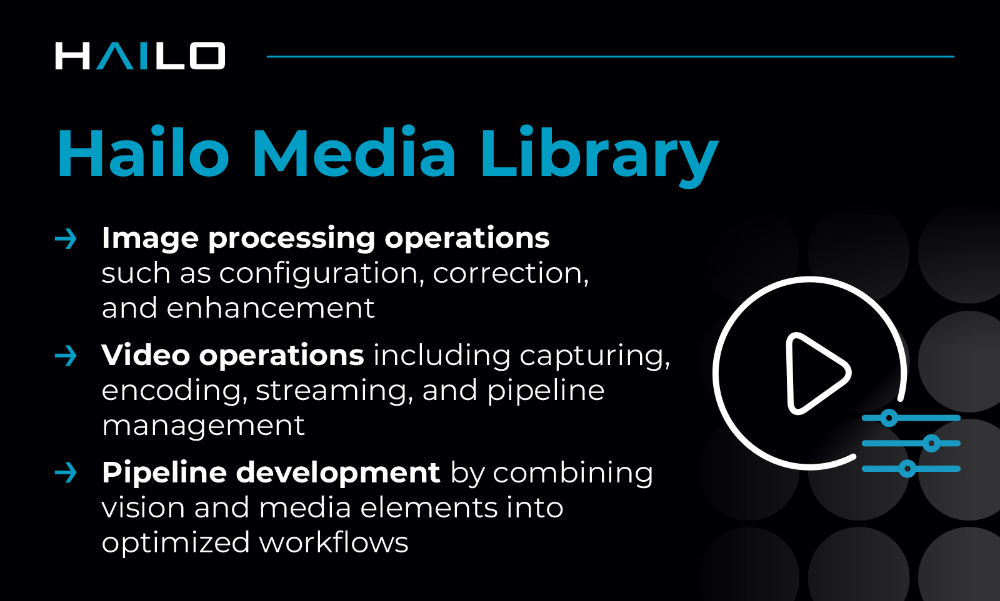

Hailo Media Library
===================

.. |gstreamer| image:: https://img.shields.io/badge/gstreamer-1.20-blue
   :target: https://gstreamer.freedesktop.org/
   :alt: Gstreamer 1.20
   :width: 150
   :height: 20

.. |hailort| image:: https://img.shields.io/badge/HailoRT-5.2.0-green
   :target: https://github.com/hailo-ai/hailort
   :alt: HailoRT 5.2.0
   :height: 20

.. |license| image:: https://img.shields.io/badge/License-LGPLv2.1-green
   :target: https://github.com/hailo-ai/hailo-media-library/blob/master/LICENSE
   :alt: License: LGPL v2.1
   :height: 20

|gstreamer| |hailort| |license|

----

Overview
--------

The Hailo Media Library provides media control and handling for Hailo-15, delivering an integrated set of APIs for managing the Hailo-15 vision subsystem. The library supports video capture, video encoding, on-screen displays (OSD), and image enhancement capabilities.

Highlights
----------
* The media library extends native media interfaces, enabling continued use of v4l2, HailoRT, and GStreamer, while also providing a simpler, unified interface for common media operations within a single framework.
* It includes analytics APIs that simplify the integration and use of HailoRT for AI inference and vision-based analytics.

Reference Code and Application Examples
---------------------------------------
The Hailo Media Library includes reference code and application examples that demonstrate integration and usage through both C++ APIs and GStreamer elements. These examples showcase real‑world use cases and best practices for leveraging Hailo‑15 AI vision capabilities, including:
• Reference code examples: AI Vision, AI Analytics 
• Reference applications: Webserver/ Dynamic Privacy Masking (DPM), Face Landmark, Single Stream Processing, Single Stream Object Detection, Dual-sensor Processing, Dual-sensor Face Landmark, Gstreamer Vision Analytics & Encoder

The reference code and applications examples are available in the `Hailo-media-library repository <https://github.com/hailo-ai/hailo-media-library/tree/1.11.0>`

Further Reading
---------------
The Hailo-15 is supported by a rich ecosystem of tools and libraries. To fully leverage these resources, visit the
`Hailo Developer Zone <https://hailo.ai/developer-zone/documentation/>`_.
