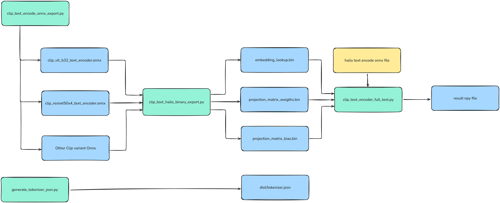

# CLIP Text Encoder ONNX Export and Hailo Binary Generation

This directory contains tools for generating ONNX models from CLIP text encoders and creating Hailo-compatible binary files for inference.

## 🔄 Workflow Overview



The complete workflow consists of three main steps:

1. **ONNX Export**: Convert CLIP text encoder from PyTorch to ONNX format
2. **Binary Generation**: Extract weights and create Hailo-compatible binary files
3. **Testing**: Validate the generated files against the original PyTorch model

## 📁 Directory Structure

```
clip_encoder_onnx/
├── README.md                           # This documentation
├── Text-Encoder-Workflow-2025-09-24.png # Workflow diagram
├── clip_text_encode_onnx_export.py     # Step 1: ONNX export script
├── clip_text_hailo_binary_export.py    # Step 2: Binary generation script
├── clip_text_encoder_full_test.py      # Step 3: Testing script (optional)
├── clip_vit_b32_text_encoder_full.onnx # Example of Generated ONNX model (ViT-B/32)
├── clip_resnet50x4_text_encoder_full.onnx # Example of Generated ONNX model (RN50x4)
├── vit_b_32_binary/                    # Example of Generated binary files for ViT-B/32
│   ├── embedding_lookup.bin
│   ├── projection_matrix_weights.bin
│   └── projection_matrix_bias.bin
└── resnet_50x4_binary/                 # Example of Generated binary files for RN50x4
    ├── embedding_lookup.bin
    ├── projection_matrix_weights.bin
    └── projection_matrix_bias.bin
```

## 🚀 Getting Started

### Prerequisites

Before running the scripts, ensure you have the required dependencies:

```bash
pip install torch torchvision clip-by-openai onnx onnxruntime numpy
```

### Supported Models

The toolkit supports the following CLIP models:

| Model      | Description                                | Embedding Dimension | Output Directory      |
| ---------- | ------------------------------------------ | ------------------- | --------------------- |
| `ViT-B/32` | Vision Transformer Base with 32x32 patches | 512                 | `vit_b_32_binary/`    |
| `RN50x4`   | ResNet-50 with 4x width multiplier         | 640                 | `resnet_50x4_binary/` |

**NOTE**: Other CLIP model can be manually added in clip_text_encode_onnx_export.py

## 📋 Step-by-Step Usage

### Step 1: Generate ONNX Model

Use `clip_text_encode_onnx_export.py` to convert the CLIP text encoder to ONNX format:

```bash
# Export ViT-B/32 model
python clip_text_encode_onnx_export.py --model "ViT-B/32" --device cpu

# Export RN50x4 model
python clip_text_encode_onnx_export.py --model "RN50x4" --device cpu

# Export all supported models
python clip_text_encode_onnx_export.py --all --device cpu
```

**Options:**

-   `--model`: Specify model variant (`"ViT-B/32"` or `"RN50x4"`)
-   `--device`: Computation device (`cpu` or `cuda`)
-   `--all`: Export all supported models
-   `--list-models`: Show available models

**Output:**

-   `clip_vit_b32_text_encoder_full.onnx` (for ViT-B/32)
-   `clip_resnet50x4_text_encoder_full.onnx` (for RN50x4)

### Step 2: Generate Hailo Binary Files

Use `clip_text_hailo_binary_export.py` to extract weights and create binary files:

```bash
# Generate binaries for ViT-B/32
python clip_text_hailo_binary_export.py --onnx-path clip_vit_b32_text_encoder_full.onnx --output-dir vit_b_32_binary

# Generate binaries for RN50x4
python clip_text_hailo_binary_export.py --onnx-path clip_resnet50x4_text_encoder_full.onnx --output-dir resnet_50x4_binary

# List tensors in ONNX file (debugging)
python clip_text_hailo_binary_export.py --onnx-path clip_vit_b32_text_encoder_full.onnx --list-tensors
```

**Options:**

-   `--onnx-path`: Path to the ONNX model file
-   `--output-dir`: Output directory for binary files
-   `--list-tensors`: List all available tensors in the ONNX model

**Generated Files:**

-   `embedding_lookup.bin`: Token embedding matrix for text tokenization
-   `projection_matrix_weights.bin`: Text projection layer weights
-   `projection_matrix_bias.bin`: Text projection layer bias (if present)

### Step 3: Test Generated Files (Optional)

Use `clip_text_encoder_full_test.py` to validate the generated files:

```bash
# Test ViT-B/32 model
python clip_text_encoder_full_test.py \
    --prompt "a photo of a cat" \
    --bin-folder ./vit_b_32_binary \
    --hailo-onnx-path ./clip_vit_b32_text_encoder_full.onnx \
    --model "ViT-B/32" \
    --output-dir ./test_output

# Test RN50x4 model
python clip_text_encoder_full_test.py \
    --prompt "a beautiful sunset over the ocean" \
    --bin-folder ./resnet_50x4_binary \
    --hailo-onnx-path ./clip_resnet50x4_text_encoder_full.onnx \
    --model "RN50x4" \
    --output-dir ./test_output

# Test with custom sentence embedding
python clip_text_encoder_full_test.py \
    --prompt "a photo of a cat" \
    --bin-folder ./vit_b_32_binary \
    --hailo-onnx-path ./clip_vit_b32_text_encoder_hailo.onnx \
    --sentence-embedding-path ./my_sentence_embedding.npy \
    --model "ViT-B/32" \
    --output-dir ./test_output
```

**Options:**

-   `--prompt`: Text prompt for testing (default: "a photo of a cat")
-   `--bin-folder`: Directory containing binary files
-   `--hailo-onnx-path`: Path to the hailo ONNX model that only contain teh tranformer portion
-   `--model`: Model variant to test
-   `--output-dir`: Output directory for test results
-   `--sentence-embedding-path`: Optional custom sentence embedding file generated from H15 clip application

**Test Results:**
The test script performs comprehensive validation and generates:

-   Comparison results between PyTorch and Hailo implementations
-   Intermediate results saved as `.npy` files
-   Detailed accuracy metrics and performance analysis

## 🔧 Implementation Details

### Token Embedding Process

The text encoder workflow consists of several key steps:

1. **Tokenization**: Convert text to token IDs using CLIP's tokenizer
2. **Embedding Lookup**: Map token IDs to embeddings using `embedding_lookup.bin`
3. **Transformer Processing**: Process embeddings through transformer layers (handled by hailo ONNX/H15)
4. **Text Projection**: Apply final linear projection using weight/bias matrices
5. **L2 Normalization**: Normalize the final embeddings

### Binary File Formats

All binary files use little-endian float32 format:

-   **embedding_lookup.bin**: Token embedding matrix [vocab_size, embedding_dim]
-   **projection_matrix_weights.bin**: Linear projection weights [hidden_dim, output_dim]
-   **projection_matrix_bias.bin**: Linear projection bias [output_dim] (optional)

### ONNX Model Configuration

The exported ONNX models include:

-   **Input**: Token IDs as int32 tensors with shape [batch_size, sequence_length]
-   **Output**: Text embeddings as float32 tensors with shape [batch_size, embedding_dim]
-   **Dynamic Axes**: Support for variable batch sizes
-   **Opset Version**: 14 for optimal compatibility

## 🐛 Troubleshooting

### Common Issues

1. **Missing Dependencies**

    ```bash
    pip install torch torchvision clip-by-openai onnx onnxruntime numpy
    ```

2. **CUDA Out of Memory**

    ```bash
    # Use CPU instead
    python clip_text_encode_onnx_export.py --model "ViT-B/32" --device cpu
    ```

3. **Tensor Name Mismatch**

    ```bash
    # List available tensors
    python clip_text_hailo_binary_export.py --onnx-path model.onnx --list-tensors
    ```

4. **Large Model Files**
    - ViT-B/32 ONNX: ~150MB
    - RN50x4 ONNX: ~250MB
    - Ensure sufficient disk space

### Validation

Always run the test script to validate your generated files:

```bash
python clip_text_encoder_full_test.py --model "ViT-B/32" --bin-folder ./vit_b_32_binary
```

The test should show minimal differences (<1e-4) between PyTorch and Hailo implementations.

## 📖 Example Usage

Here's a complete example workflow:

```bash
# Step 1: Generate ONNX model
python clip_text_encode_onnx_export.py --model "ViT-B/32"

# Step 2: Create binary files
python clip_text_hailo_binary_export.py \
    --onnx-path clip_vit_b32_text_encoder_full.onnx \
    --output-dir vit_b_32_binary

# Step 3: Validate results
python clip_text_encoder_full_test.py \
    --prompt "a photo of a dog playing in the park" \
    --bin-folder ./vit_b_32_binary \
    --hailo-onnx-path ./clip_vit_b32_text_encoder_full.onnx \
    --model "ViT-B/32" \
    --output-dir ./validation_results
```

This complete workflow generates all necessary files for Hailo-accelerated CLIP text encoding inference.

## 📝 Notes

-   The generated binary files are compatible with Hailo inference engines
-   ONNX models support dynamic batch sizes for flexible inference
-   All intermediate results can be saved for debugging and analysis
-   The workflow is optimized for both ViT and ResNet CLIP architectures
